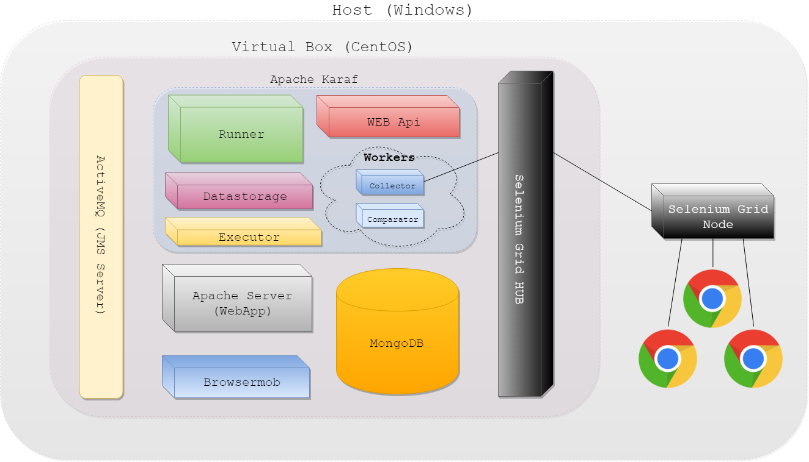

## Environment Setup

There are two ways to setup the AET environment: basic and advanced.

##### Basic

The basic setup makes use of [Vagrant](https://www.vagrantup.com/) to create a single virtual machine running Linux OS (currently CentOS 6.8). This virtual machine contains all AET services, except the Google Chrome browser and the Selenium Grid node process which needs to be started separately (e.g. on the host machine).

See **[[Basic Setup|BasicSetup]]** for more details.

The diagram below shows the basic AET setup.

##### Advanced

The advanced setup on the other hand makes use of at least two separate machines - one running a Linux OS and the other ones running Windows. The Linux machine hosts all AET services and the Windows machines are hosting Selenium Grid node processes together with Google Chrome browser.

See **[[Advanced Setup|AdvancedSetup]]** for more details.

The diagram below shows the advanced AET setup.

